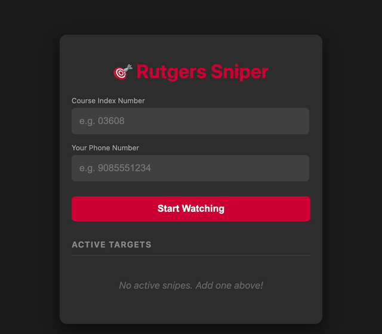

# 🎯 Rutgers Course Sniper

[](https://github.com/Aryaasd/rutgers-course-sniper/actions/workflows/ci.yml)

A Java Spring Boot service that watches Rutgers Schedule-of-Classes sections and sends a real-time SMS via Twilio the moment a closed section opens up.



---

## 🚀 Features

* **Automated sniping:** Polls the Rutgers Schedule of Classes API for any subject/term/year/campus combination currently being tracked — not hardcoded to one department.
* **Database persistence:** Stores tracking requests in PostgreSQL, schema-managed by Flyway.
* **SMS notifications:** Integrates with Twilio to send instant alerts when a section opens.
* **Owner-scoped API:** Each watch is protected by a token issued at creation time — nobody else can see it or delete it, and listing without a token returns nothing.
* **Phone verification:** A number is never texted until it confirms a code sent via Twilio Verify — registering a watch doesn't mean a stranger's phone starts getting messages.
* **Abuse throttling:** New watches are rate-limited per IP.
* **Memory optimized:** Tuned to run in containerized environments (like Railway) under strict memory limits.

---

## 🛠️ Tech Stack

| Layer | Technology |
| --- | --- |
| Language | Java 21 |
| Framework | Spring Boot 3 |
| Database | PostgreSQL (Hibernate/JPA), schema via Flyway |
| Notifications | Twilio SDK |
| Build | Maven |
| CI | GitHub Actions |
| Deployment | Railway |

---

## ⚙️ Configuration

The application reads all credentials from the environment. Set these in your deployment platform, or use the `local` profile below to run without any of them.

| Variable | Description |
| --- | --- |
| `DATABASE_URL` | JDBC URL for your PostgreSQL database |
| `DATABASE_USERNAME` | Database username |
| `DATABASE_PASSWORD` | Database password |
| `TWILIO_ACCOUNT_SID` | Your Twilio Account SID |
| `TWILIO_AUTH_TOKEN` | Your Twilio Auth Token |
| `TWILIO_PHONE_NUMBER` | The Twilio number the SMS is sent from |
| `TWILIO_VERIFY_SERVICE_SID` | Your Twilio Verify Service SID. Unset in dev: new watches auto-confirm instead of requiring a code, so local testing doesn't need a live Verify Service. |
| `PORT` | Server port (defaults to `8080`) |

> Never commit real credentials. `src/main/resources/application-local.properties` is gitignored for exactly this purpose.

---

## 📦 Running Locally

**1. Clone the repository**

```bash
git clone https://github.com/Aryaasd/rutgers-course-sniper.git
cd rutgers-course-sniper
```

**2. Run it**

The `local` profile starts the app against an in-memory H2 database, so you don't need Postgres or any cloud setup to try it:

```bash
./mvnw spring-boot:run -Dspring-boot.run.profiles=local
```

Create `src/main/resources/application-local.properties` with your own H2 and Twilio settings (the file is gitignored). Leave the Twilio values blank to run without SMS — `SmsService` falls back to logging alerts to the console.

To run against a real PostgreSQL database instead, export the environment variables from the table above and run `./mvnw spring-boot:run`.

**3. Run the tests**

```bash
./mvnw test
```

---

## 📡 API

Sections are registered through the REST API at `/api`. Every watch is protected by an **owner token** issued when you create it — hold onto it, it's the only way to list or delete that watch later, and it is never sent back to you again after creation.

**Start watching a section**

```bash
curl -X POST http://localhost:8080/api/sections \
  -H "Content-Type: application/json" \
  -d '{"sectionIndex": "03608", "userContact": "+15555550123"}'
```

```json
{
  "section": { "id": 1, "sectionIndex": "03608", "subject": "198", "term": "9", "year": 2025, "campus": "NB", "confirmed": false, "userContact": "+15555550123", "open": false },
  "ownerToken": "6a9b3e6c-1c09-4ab0-9b31-57ac2d55d334",
  "codeSent": true
}
```

`subject`, `term`, `year`, and `campus` are optional and default to Fall 2025 Computer Science at New Brunswick (`198` / `9` / `2025` / `NB`) — pass your own to track a section in any other department or term. Creation is rate-limited to 5 new watches per IP per 10 minutes.

**Confirm the phone number**

If `TWILIO_VERIFY_SERVICE_SID` is set, the section comes back `confirmed: false` and a code is texted to `userContact`. Nothing gets alerted until it's confirmed:

```bash
curl -X POST http://localhost:8080/api/sections/1/verify \
  -H "Content-Type: application/json" \
  -H "X-Owner-Token: 6a9b3e6c-1c09-4ab0-9b31-57ac2d55d334" \
  -d '{"code": "123456"}'
```

`204` on success, `422` on a wrong or expired code, `403` on a bad owner token. If the code expired, resend it:

```bash
curl -X POST http://localhost:8080/api/sections/1/resend-code \
  -H "X-Owner-Token: 6a9b3e6c-1c09-4ab0-9b31-57ac2d55d334"
```

Without `TWILIO_VERIFY_SERVICE_SID` configured (the local-dev default), sections come back `confirmed: true` immediately and there's nothing to verify.

**List your own watched sections**

Requires the token(s) you were given at creation, comma-separated if you're tracking more than one. No token, no data — this endpoint never returns other people's watches.

```bash
curl http://localhost:8080/api/sections \
  -H "X-Owner-Tokens: 6a9b3e6c-1c09-4ab0-9b31-57ac2d55d334"
```

**Stop watching a section**

Requires the matching owner token, or the delete is rejected with `403`.

```bash
curl -X DELETE http://localhost:8080/api/sections/1 \
  -H "X-Owner-Token: 6a9b3e6c-1c09-4ab0-9b31-57ac2d55d334"
```

Once a section is confirmed, the scheduler polls its subject/term/year/campus combination automatically and texts `userContact` when it opens. Unconfirmed sections are still polled — the moment you confirm, the next poll catches an already-open section instead of waiting for it to close and reopen.

---

## ☁️ Deployment (Railway)

1. **Connect GitHub:** Link this repository to a new Railway service.
2. **Add a database:** Add a PostgreSQL service in Railway. Flyway applies the schema automatically on first boot.
3. **Set variables:** Railway provides the database connection automatically, but you must add your Twilio credentials in the **Variables** tab, including `TWILIO_VERIFY_SERVICE_SID` — without it, phone verification is skipped entirely and every new watch is texted with no confirmation step.
4. **Cap the heap:** To prevent Out-Of-Memory crashes on smaller tiers, add:

   ```
   JAVA_TOOL_OPTIONS=-Xmx300m -Xms300m
   ```

---

## ⚠️ Disclaimer

This tool is for educational purposes. Please use it responsibly and comply with the university's API usage policies to avoid rate limiting or IP bans.

---

## 📄 License

MIT
